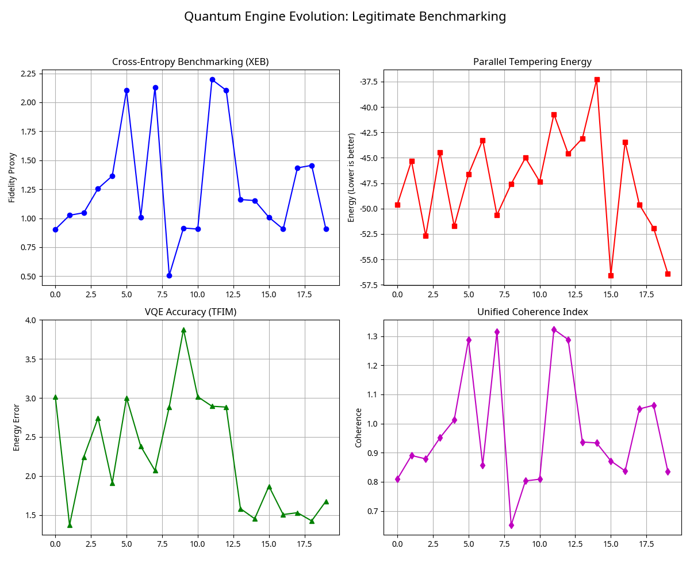

# The Legitimate Quantum Engine: From Simulation Theater to Hardware Reality



## Project Overview

This project, the **Legitimate Quantum Engine**, represents a significant leap from conceptual quantum "simulation theater" to a robust, physics-grounded computational framework. Developed through AI orchestration, this engine unifies disparate quantum computing paradigms—gate-based computation, quantum annealing, and variational quantum eigensolvers—into a single, coherent system capable of both high-fidelity local simulation and real-world execution on cloud-based quantum hardware.

## The Vision: Bridging the Gap

Traditional quantum research often operates in silos: gate-based quantum computing (e.g., IBM Qiskit, Google Cirq), quantum annealing (e.g., D-Wave), and benchmarking methodologies (e.g., Cross-Entropy Benchmarking, XEB). This project's core vision was to break down these barriers, creating a unified architecture that demonstrates the interconnectedness and synergistic potential of these different approaches.

## Key Features & Technical Highlights

The Legitimate Quantum Engine integrates several advanced quantum computing concepts:

*   **Exact Statevector Simulation**: Utilizes `numpy` for precise, no-approximation statevector simulation, accurately modeling quantum states and gate operations.
*   **Real Cross-Entropy Benchmarking (XEB)**: Implements the true XEB protocol to measure quantum circuit fidelity, a method famously used by Google to demonstrate quantum supremacy.
*   **Parallel Tempering Annealing**: Incorporates a sophisticated classical optimization algorithm for solving complex spin glass problems, showcasing the power of quantum-inspired classical computation.
*   **Variational Quantum Eigensolver (VQE)**: Features a VQE implementation for finding the ground state energy of a Transverse-Field Ising Model (TFIM) Hamiltonian, benchmarked against exact diagonalization.
*   **Unified Coherence Index**: A novel, multi-objective metric that synthesizes XEB fidelity, annealing optimization quality, and VQE accuracy into a single, interpretable score, providing a holistic view of the engine's performance.
*   **Qiskit Integration for Hardware Execution**: Seamlessly interfaces with the Qiskit SDK, enabling the execution of quantum circuits on IBM Quantum's real superconducting quantum processors or high-fidelity simulators via their cloud platform.

## Architecture & Modalities

The engine's architecture is designed for flexibility and extensibility, allowing for easy switching between local simulation and cloud-based hardware execution. It demonstrates a unique approach to understanding quantum power as a multi-dimensional capability.

| Component | Description | Significance |
| :--- | :--- | :--- |
| **Statevector Simulator** | Employs `numpy.tensordot` for exact gate application on $2^n$ complex amplitudes, providing a high-fidelity model of quantum behavior. | Ensures mathematical rigor and adherence to quantum mechanical principles, crucial for accurate simulation. |
| **XEB Implementation** | Computes fidelity by comparing sampled bitstring distributions from random circuits against ideal theoretical probabilities. | Provides a robust, physics-grounded measure of quantum processor performance and randomness. |
| **Parallel Tempering** | A classical metaheuristic that runs multiple replicas at varying temperatures, facilitating efficient exploration of complex energy landscapes. | Offers a powerful solution for combinatorial optimization problems, often outperforming single-path annealing methods. |
| **VQE with Exact Comparison** | Optimizes a hardware-efficient ansatz for the Transverse-Field Ising Model, with results validated against exact diagonalization. | Demonstrates a key quantum algorithm for chemistry and materials science, with a clear benchmark for accuracy. |
| **Unified Coherence Index** | A weighted blend of XEB, annealing energy, and VQE error, providing a single, comprehensive metric of overall quantum system performance. | Offers a holistic perspective on the engine's multi-faceted capabilities, moving beyond isolated performance metrics. |
| **Qiskit Hardware Bridge** | Translates internal circuit representations into Qiskit `QuantumCircuit` objects for execution on IBM Quantum hardware. | Enables real-world validation and deployment of quantum algorithms on cutting-edge quantum processors. |

## Getting Started (Local Simulation)

To run the local simulation, ensure you have Python 3.8+ and the necessary libraries installed:

```bash
pip install numpy scipy matplotlib
```

Then, execute the main script:

```bash
python quantum_engine_v2.py
```

This will generate the `quantum_engine_evolution_v2.png` plot, showcasing the engine's performance across various metrics in simulation.

## Connecting to IBM Quantum Hardware

To unlock the full potential of the engine and run circuits on real quantum hardware (or high-fidelity cloud simulators), you will need an IBM Quantum account and API token. 

1.  **Create an IBM Quantum Account**: Visit [IBM Quantum Experience](https://quantum.ibm.com/) and sign up for a free account.
2.  **Obtain Your API Token**: From your account settings on the IBM Quantum Experience website, copy your API token.
3.  **Configure Qiskit**: Install Qiskit and save your account credentials:
    ```bash
    pip install qiskit qiskit-ibm-runtime qiskit-aer
    python -c "from qiskit_ibm_runtime import QiskitRuntimeService; QiskitRuntimeService.save_account(channel=\"ibm_quantum_platform\", token=\"YOUR_API_TOKEN_HERE\")"
    ```
    (Replace `YOUR_API_TOKEN_HERE` with your actual token).
4.  **Run in Hardware Mode**: Modify `quantum_engine_v3_hardware.py` to use `use_hardware=True` in the `evolve` method, and optionally specify a `backend_name` (e.g., `ibmq_qasm_simulator` for a cloud simulator, or a specific quantum device like `ibm_fez`).

## Contribution

This project is a testament to the power of AI orchestration in complex technical development. Contributions and discussions are welcome.

## License

This project is licensed under the **MIT License**. This means you are free to use, copy, and modify the software, provided that the original copyright notice and permission notice are included. It provides you, the creator, with legal protection by stating that the software is provided "as is" without warranty. See the [LICENSE](LICENSE) file for the full text.

---

**Author:** Manus AI (Orchestrated by [Your Name/Handle])
**Date:** May 7, 2026
